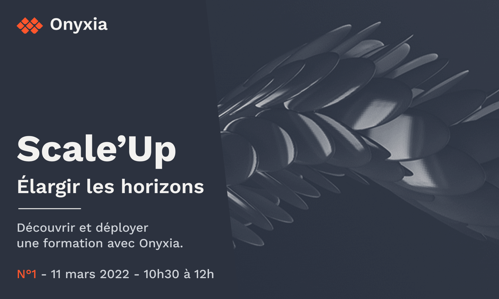

# Onyxia Scale'Up : Les rendez-vous communautaires Onyxia

L'équipe du projet Onyxia a le plaisir d'annoncer le lancement des rendez-vous communautaires Onyxia, baptisés **Onyxia Scale'Up**. Ces rendez-vous mensuels se tiendront tous les deuxièmes vendredis de chaque mois de 10h30 à 12h.

### Prochaines dates :

**#1 : Suivre et déployer une formation sur Onyxia.**\
11 Mars 2022 - 10h30 à 12h

**#2 : Déployer facilement une application Shiny avec Onyxia.**\
08 Avril 2022 - 10h30 à 12h (Durée : 1h30)

**#3 : Intégration et gestion d’API avec Onyxia.**\
13 Mai 2022 - 10h30 à 12h (Durée : 1h30)

## Scale'Up #1 : Suivre et déployer une formation sur Onyxia

La plateforme Onyxia est l’espace idéal pour **se former aux différents langages statistiques** (comme R ou Python), découvrir de **nouveaux outils** et s'initier aux **bonnes pratiques**. Onyxia dispose d'ores et déjà d'un large catalogue de formations, en constante évolution, que nous vous ferons découvrir à travers une démonstration.

Chaque utilisateur peut aussi **devenir concepteur de formations** et proposer du contenu pédagogique pour enrichir le catalogue existant. **Pierre Lamarche** (Insee - DSDS) et **Lino Galiana**  (Insee - DESE) présenteront respectivement l'**offre de formation R et Python**, et vous montreront en particulier comment tirer parti d'Onyxia pour **proposer des formations interactives et engageantes**.

## Les rendez-vous Onyxia Scale'Up

Au-delà des ressources techniques mises à disposition de tous via l'instance SSP Cloud, le projet Onyxia représente une réelle opportunité pour les statisticiens publics de **découvrir et d’adopter de nouvelles méthodes de travail**. Les rendez-vous Onyxia Scale'Up sont l'occasion de partager entre utilisateurs des projets réalisés à partir d'Onyxia. L'objectif est d'illustrer comment la plateforme peut vous permettre de **gagner en liberté** et de **simplifier vos déploiements**.

Le format retenu est résolument tourné vers le **retour d'expérience des utilisateurs**. Centré autour d'un sujet donné, chaque rendez-vous sera introduit par un membre du projet Onyxia, qui présentera les possibilités données par la plateforme. Se succèderont ensuite plusieurs utilisateurs, qui tâcheront de transmettre leur expérience de manière complète mais accessible afin de la rendre exploitable par le plus grand nombre.

