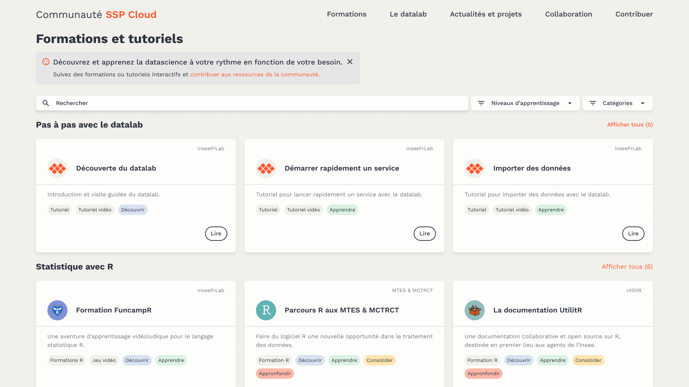
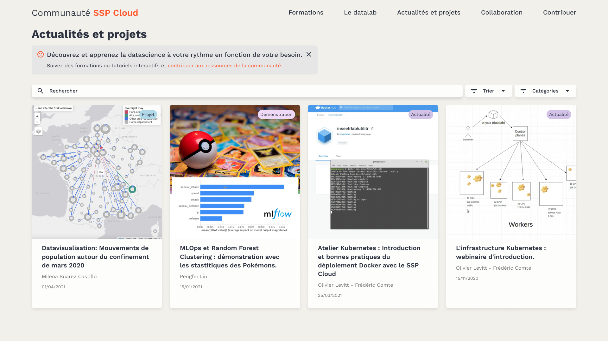

# 🔍 Référencer son contenu sur le site sspcloud.fr

## 🎓 Référencer une formation&#x20;

[Le catalogue d'actualités et projets](https://spyrales.sspcloud.fr/trainings) est alimenté à partir du fichier `json` qui se trouve ci-dessous. Il est possible d'y référencer du contenu de type :‌

* **Onyxia - Guide** pour tous les pas à pas de prise en main de la plateforme Onyxia
* **Tutoriels** pour diverses aides, guides et formations



Il vous suffit donc de faire une _**merge request**_ proposant de nouveaux contenus.‌

En pratique, il s'agit de créer de nouvelles entrées dans ce fichier avec les méta-données sur les formations que vous souhaitez référencer. Ces méta-données sont structurées suivant le schéma [http://schema.org/Course](http://schema.org/Course).

## 🗞 Référencer une actualité ou un projet

[Le catalogue d'actualités et projets](https://spyrales.sspcloud.fr/trainings)  est alimenté à partir du fichier `json` qui se trouve ci-dessous.  Il est possible d'y référencer du contenu de type :&#x20;

* **Démonstrations** (proposer des bouts de codes, des projets exploratoire, etc.)
* **Actualités** (article de blog ou présenter un évènement)
* **Projets** (présenter des cas d'usages du datalab)



Il vous suffit donc de faire une _**merge request**_ proposant de nouveaux contenus.

En pratique, il s'agit de créer de nouvelles entrées dans ce fichier avec les méta-données sur les formations que vous souhaitez référencer. Ces méta-données sont structurées suivant le schéma [http://schema.org/Course](http://schema.org/Course).&#x20;
