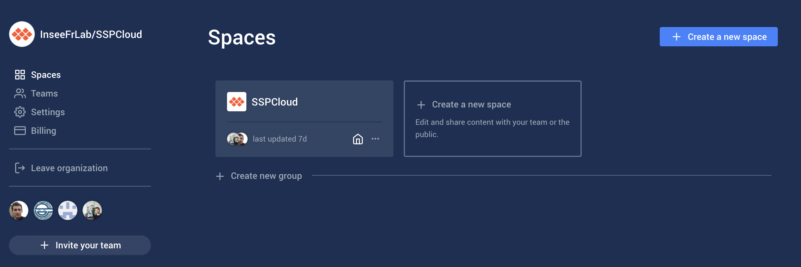
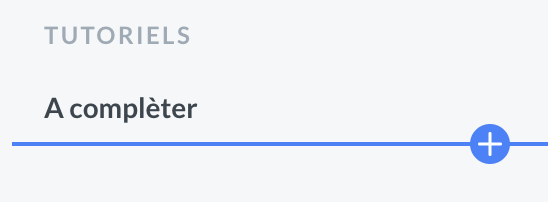
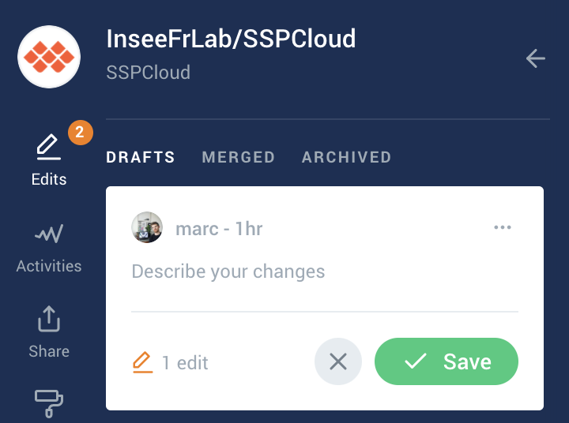

# Comment contribuer à la documentation?

## 🤝 Pourquoi contribuer ?

* Tu souhaites écrire un article, un tutoriel, une formation ou tout simplement créer une nouvelle page ?
* Tu souhaites mettre à jour ou corriger du contenu sur ce guide ?

## ✍ Comment devenir contributeur ?  

Chaque membre de la communauté peut devenir éditeur et proposer des modifications et améliorations à ce guide en ligne.

Pour contribuer à ce guide avec Gitbook, tu as deux choix :

* Simplement poster ce message sur[ le canal Tchap](https://tchap.gouv.fr/#/room/#SSPCloudXDpAw6v:agent.finances.tchap.gouv.fr) : "Bonjour, j'aimerai rejoindre l'équipe d'organisation de **la documentation?"**. Un membre de la communauté t'enverra les accès.
* Si tu es doué avec Github, tu peux aussi modifier ce guide directement [ici](https://github.com/InseeFrLab/docs.sspcloud.fr).


Tu ne prends aucun risque à "casser" quoi que ce soit.


## ​📄 Comment utiliser et éditer Gitbook pour la documentation ?

### Étape 1: Créer un compte

Configurez un compte GitBook sur [https://www.gitbook.com/](https://www.gitbook.com/). Il est préférable de créer votre compte GitBook en utilisant votre compte GitHub pour que les modifications puissent vous être attribuées [dans les sources](https://github.com/InseeFrLab/docs.sspcloud.fr/tree/master/docs).

### Étape 2 : Obtenir l'accès 

Pour obtenir l'accès,  poster un message sur[ le canal Tchap](https://tchap.gouv.fr/#/room/#SSPCloudXDpAw6v:agent.finances.tchap.gouv.fr) en demandant un accès à l'édition et l'écriture et suivez le lien qu'il vous sera transmis. Ce lien vous donnera un accès en édition aux documents publics SPP Cloud ainsi qu'à l'espace interne  SPP Cloud .

### 🚧 Étape 3 : Accédez à l'interface d'édition 

[Cliquez sur ce lien](https://app.gitbook.com/@sspcloud/spaces) pour accéder à notre tableau de bord. Une fois sur notre tableau de bord, sélectionnez l'espace SPP Cloud ou créer un nouvel espace.

Vous aurez maintenant une barre latérale avec des options de brouillon. Cliquez sur n'importe quelle page et commencez à taper/éditer pour commencer un nouveau brouillon. 

Un brouillon peut contenir des modifications sur plusieurs pages.  Vous pouvez également créer de nouvelles pages en passant la souris sur la barre latérale :

### Étapes 4 : L'organisation des pages 

Concernant l'organisation des pages, nous avons construit le Gitbook de la façon suivante:

* **Onyxia - Guide** pour tous les pas à pas de prise en main de la plateforme Onyxia
* **Exemples** pour proposer des bouts de codes, des projets exploratoire, etc.
* **Tutoriels** pour diverses aides, guides et formations
* **Projets** pour présenter des cas d'usages du datalab et les services et fonctionnalités utilisées. [Comment présenter un projet ?](comment-presenter-un-projet.md)


Après avoir effectué une modification ou ajouter une page, pensez à décrire les modifications avec un court message en cliquant sur « Décrire ce brouillon » dans la section Brouillons de la barre latérale et en rédigeant une brève description :


### Étape 5 : Publication du contenu 

Après avoir rédigé et enregistré votre brouillon et après lui avoir donné une description. Il y a deux cas possibles : 

1. Vous avez écrit un brouillon assez long, vous n'êtes pas sûr que le style soit tout à fait cohérent avec le reste de nos documents, vous avez eu un problème ou avez simplement écrit un brouillon rapide qui nécessiterai des retours, des conseils ou des corrections.  
2. Vous avez apporté une modification mineure ou passé beaucoup de temps à créer une page soignée et cohérente qui, selon vous, ne contient pas d'erreurs. 

Si vous tombez dans le cas 1, ou si vous ne vous identifiez pas à l'un ou l'autre des cas, veuillez envoyer un message dans[ le canal Tchap](https://tchap.gouv.fr/#/room/#SSPCloudXDpAw6v:agent.finances.tchap.gouv.fr). Dans ce cas, l'équipe s'occupera de tous les problèmes d'édition de copie, de formatage, etc. restants et publiera votre brouillon. Vous avez terminé! 

Si vous tombez dans le cas 2, vous pouvez simplement publier votre brouillon en cliquant sur le bouton bleu "Merge" dans la barre latérale. Si vous n'êtes pas sûr que le brouillon est exempt d'erreurs, veuillez utiliser le cas 1 par défaut ; plus il y a d'yeux qui regardent le travail, mieux c'est.

### Pour toutes les autres questions et information

Consulter [la documentation GitBook](https://docs.gitbook.com/%20) et plus précisément pour les instructions de base de l'édition, voir [ici](https://docs.gitbook.com/content-editing/markdown). Si besoin d'aide, n'hésites pas à solliciter les membres du salon SSP Cloud \([sur Tchap\)](https://tchap.gouv.fr/#/room/#SSPCloudXDpAw6v:agent.finances.tchap.gouv.fr).

## Comment référencer mon contenu sur la page documentaire?

