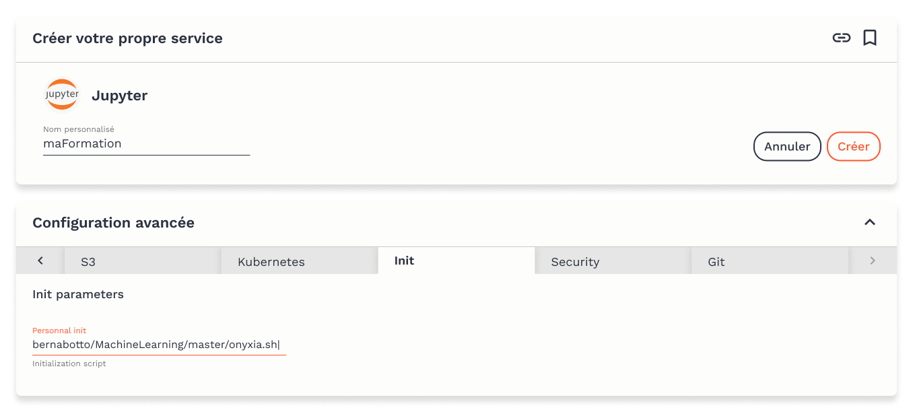
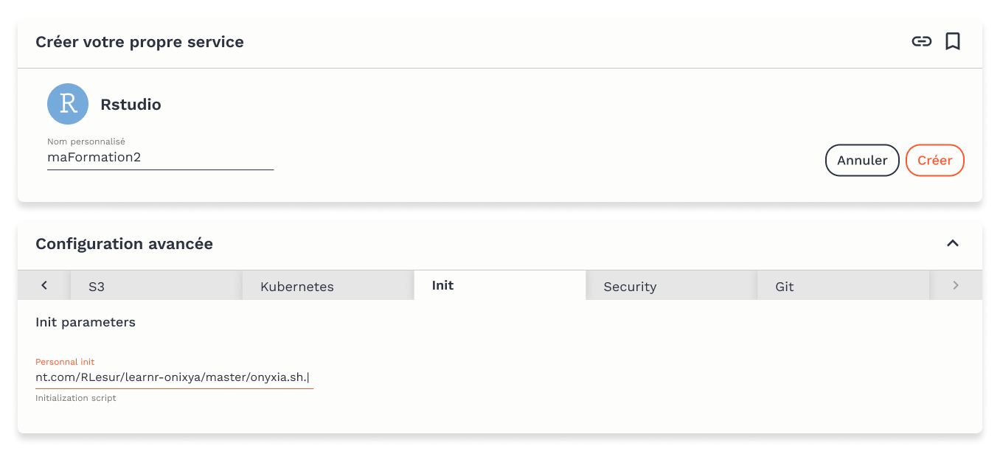

# ​🕹️​ Proposer une formation interactive grâce à Onyxia

## **Tutoriel interactif sous forme de Notebook Jupyter**

La méthode certainement la plus simple est d'héberger votre notebook Jupyter sur une plateforme `git` telle que [GitHub](https://github.com/) ou [GitLab](https://gitlab.com/).

Vous pouvez prendre comme exemple le dépôt de [Jean-Michel Bernabotto](https://www.spyrales.fr/author/jean-michel-bernabotto/) suivant : [https://github.com/jmbernabotto/MachineLearning](https://github.com/jmbernabotto/MachineLearning). Dans votre dépôt, déclarez vos dépendances dans le fichier `requirements.txt` 

Puis ajoutez un script qui sera exécuté au lancement du serveur Jupyter sur la plateforme Onyxia : vous pouvez modifier le script `onyxia.sh` que vous trouverez dans ce dépôt.

Ensuite, rendez-vous dans le [catalogue de service](https://datalab.sspcloud.fr/catalog/inseefrlab-helm-charts-datascience) d'Onyxia, sélectionnez le service Jupyter et dans les configurations avancée, dans l'onglet `Init` , collez l'URL vers le script de lancement que vous venez d'écrire. oyez bien vigilants à utiliser une URL de type _raw_ vers votre script. Par exemple, avec le dépôt ci-dessus, l'URL est [https://raw.githubusercontent.com/jmbernabotto/MachineLearning/master/onyxia.sh](https://raw.githubusercontent.com/jmbernabotto/MachineLearning/master/onyxia.sh). 

Vous pouvez alors copier le lien en cliquant sur l'icône en haut à droite et le conserver pour permettre un accès direct à votre formation.  Maintenant rendez visible et accessible votre tutoriel au sein de la communauté SSP Cloud:



## **Tutoriel interactif avec `learnr`**

`learnr` est un package R qui permet de concevoir facilement des tutoriels interactifs en R Markdown. Si vous ne le connaissez pas, n'hésitez pas à consulter l'aide : [https://rstudio.github.io/learnr](https://rstudio.github.io/learnr).

Comme précédemment, le plus simple est d'héberger votre projet RStudio comprenant votre tutoriel sur [GitHub](https://github.com/) ou [GitLab](https://gitlab.com/). Vous pouvez prendre exemple sur le dépôt de démonstration suivant : [https://github.com/RLesur/learnr-onixya](https://github.com/RLesur/learnr-onixya). Dans votre dépôt, déclarez vos dépendances dans le fichier `DESCRIPTION` et rajoutez un script qui sera exécuté au lancement du serveur RStudio sur la plateforme Onyxia : vous pouvez modifier le script `onyxia.sh` que vous trouverez dans ce dépôt.

Ensuite, rendez-vous dans le [catalogue de service](https://datalab.sspcloud.fr/catalog/inseefrlab-helm-charts-datascience) d'Onyxia,  sélectionnez le service RStudio et dans l'onglet `Init` collez l'URL vers le script de lancement.  
Soyez bien vigilants à utiliser une URL de type _raw_ vers votre script. Avec le dépôt précédent, l'URL est [https://raw.githubusercontent.com/RLesur/learnr-onixya/master/onyxia.sh](https://raw.githubusercontent.com/RLesur/learnr-onixya/master/onyxia.sh).

Vous pouvez alors copier le lien en cliquant sur l'icône en haut à droite et le conserver pour permettre un accès direct à votre formation. Maintenant rendez visible et accessible votre tutoriel au sein de la communauté SSP Cloud:



