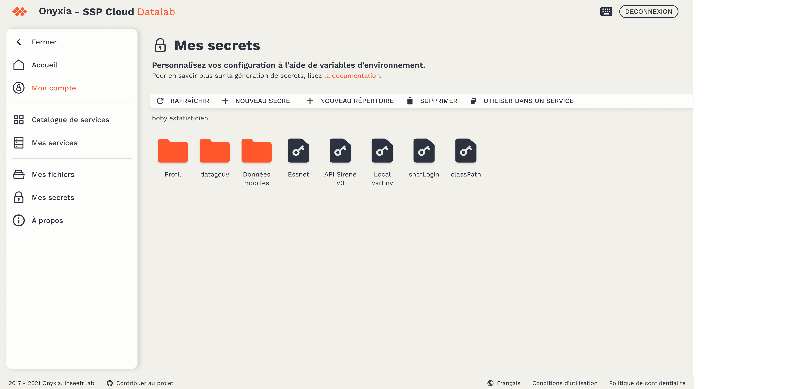

# Utiliser des secrets

### Les variables d'environnement 

Il arrive parfois que certaines informations doivent être mise à disposition d'un grand nombre d'applications ou ne peuvent pas figurer en clair dans votre code. L'utilisation de **variables d'environnement** permet de pouvoir accéder à ces informations depuis n'importe quel service.

Au lancement d'un service, plusieurs variables d'environnement sont déjà injecté automatiquement - des informations concernant GitLab et Minio \(stockage de données\) notamment. 

### Création et gestion de secrets

Sur la plateforme, les variables d'environnement sont des secrets écrits dans [Vault](https://www.vaultproject.io) \(le coffre fort du datalab\) et sont chiffrées. Cela vous permettra d'y stocker des jetons, des identifiants et des mots de passe. La page [Mes secrets](https://datalab.sspcloud.fr/my-secrets/) prends la forme d'un explorateur de fichiers où vous pouvez trier et hiérarchiser vos variables dans des dossiers.

#### Pour commencer :

* Créez un nouveau dossier `+ Nouveau dossier`
* Puis dans ce dossier, créez un nouveau secret `+ Nouveau secret`
* Ouvrer votre secret 

Chaque secret peut contenir plusieurs variables, composés de paires de clés-valeurs.

*  `+ Ajouter une variable`


Les clés \(nom de la variable\) commencent toujours \(`$`\) et contiennent uniquement des lettres, des chiffres et le caractère de soulignement \(`_`\). Par convention, les clefs s'écrivent en MAJUSCULE.


*  Remplissez le champ du nom de la clef puis sa valeur

### Convertir des secrets en variables d'environnement

Une fois votre secret édité, avec ses différentes variables, vous êtes prêt à l'utiliser dans votre service. 

* Copiez le chemin du secret en cliquant sur le bouton `Utiliser dans un service`
* Puis au moment de la configuration de votre service, allez dans l'onglet `Vault`et collez le chemin du secret dans le champ dédié

* Créez et ouvrez votre service
* Pour vérifier que vos variables ont bien été injecté, utiliser les commandes suivantes dans le terminal de votre service : Pour voir toutes les variables: `env` Pour chercher une variable spécifique: `echo $MA_VARIABLE` ou `env | grep MAVARIABLE`

### Valeur résolue

Une variable peut en référencer une autre. Par exemple, vous avez défini la variable `$PRENOM=boby`, vous pouvez alors définir une nouvelle variable `$NOM_COMPLET="$PRENOM"lestatisticien` qui aura comme valeur résolue`bobylestatisticien`.

