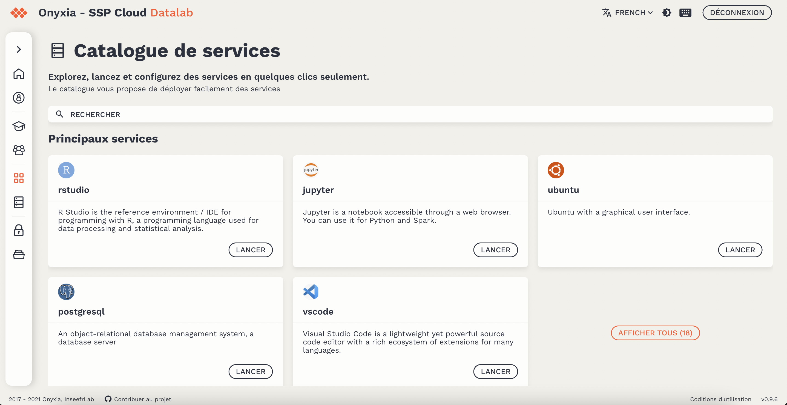
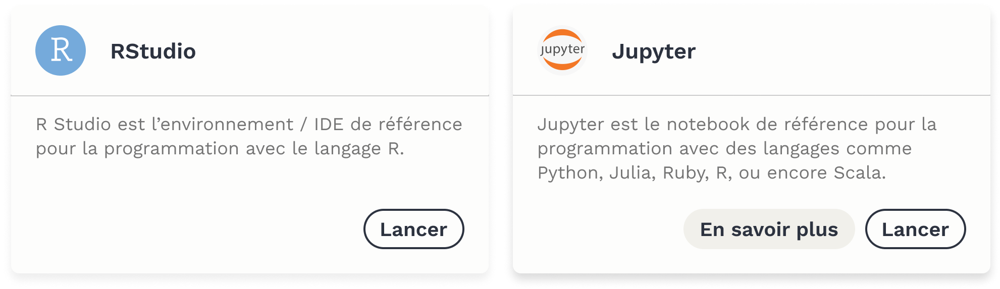
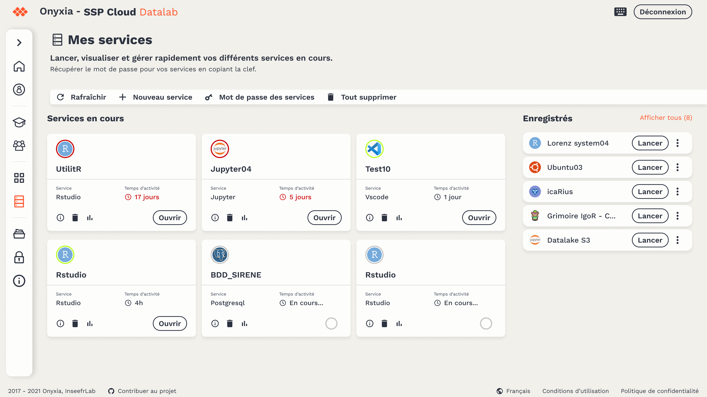
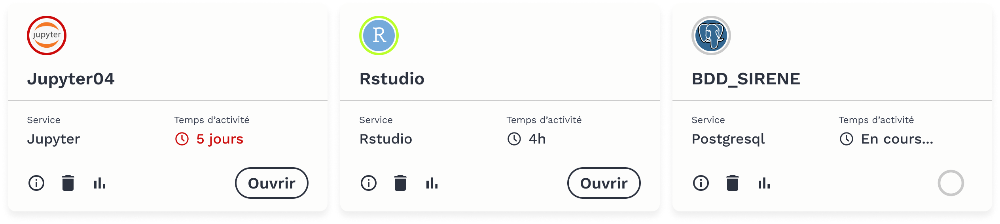
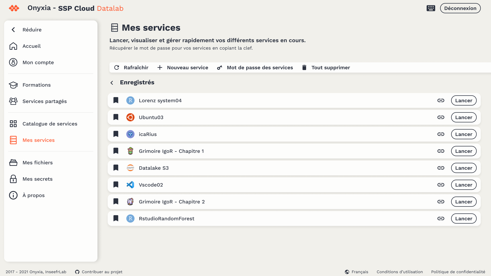

# Lancer rapidement un service

## Le catalogue de service

La plateforme Onyxia propose un catalogue de services et d'outils dédiés au traitement de données statistique et à la datascience.

Vous pouvez accéder au catalogue de service depuis la page d'accueil et le menu de navigation.

* Ouvrir le [catalogue de service](https://datalab.sspcloud.fr/my-lab/catalogue/inseefrlab-helm-charts-datascience)

Les principaux services sont présentés à la une et il est possible de réaliser recherche avancée \(en fonction de mots-clés, langage ou du nom d'un service\) à partir de la barre de recherche.

* `En savoir plus` renvoie à la documentation officielle du service
* Lancer un service

### Liste des identifiants de connexion

| Services | Identifiants |
| :--- | :--- |
| RStudio | rstudio |
| Neo4j | neo4j |
| PgAdmin | Email compte SSP Cloud |

Les autres services ne demandent pas d'identifiants.

## Mes services

La page [Mes services](https://datalab.sspcloud.fr/my-service) permet de visualiser et gérer rapidement vos différents services en cours.

* Une fois votre service chargé, cliquez sur `Ouvrir` pour accéder directement à votre service.
* Ci-dessous la liste complète des identifiants en fonction de chaque service
* Le mot de passe est le même pour tous les services et il est accessible depuis la page [Mon compte](https://datalab.sspcloud.fr/account) ou la page [Mes services](https://datalab.sspcloud.fr/my-service) en cliquant sur le bouton `Mot de passe des services`

### Gérer ses services

* Consulter vos services en cours depuis [la page d'accueil](https://datalab.sspcloud.fr/home/) et la page [Mes services](https://datalab.sspcloud.fr/my-service) 
* Supprimer votre service à partir de l'icône `Poubelle` ou supprimer tous vos services en cours en cliquant sur le bouton `Tout supprimer`
* Accéder aux paramètres de votre service à partir de l'icône `Information`  
* Visualiser la consommation de vos ressources à partir de l'icône `Graphique`
* Les services peuvent avoir différents statuts : temps d'activité long, service prêt et disponible et service en cours de chargement.


Les ressources mises à disposition pour l'execution des services sont partagées entre les différents utilisateurs du datalab et la surconsommation de ces ressources induisent des répercutions écologiques et économiques. Veuillez à ne pas laisser en cours des services dont vous ne faites plus l'usage.


### Mes services enregistrés 

Pour un confort d'usage il est possible de d'enregistrer ses services préférés ou avec des configurations spécifiques. [Voir Configurer un service.](configurer-un-service.md)

Les services enregistrés sont consultables et accessibles depuis la page [Mes services](https://datalab.sspcloud.fr/my-service). Il est possible de copier l'URL de ce service et de le partager mais aussi de le lancer en un simple clic, avec ses configurations spécifiques. Pour retirer un service de sa liste de services enregistrés, il suffit de décocher l'icône `Signet/Marque-page`

