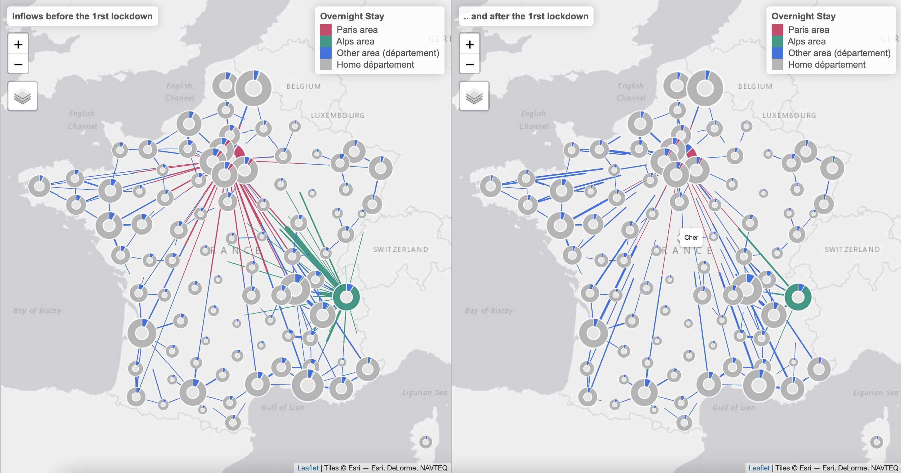

# Datavisualisation: Mouvements de population autour du confinement de mars 2020

Galiana et al. \(2020\) documentent les mouvements de population autour du confinement de mars 2020 à partir d'indicateurs anonymes issus de la téléphonie mobile fournis à l'Insee par trois opérateurs de téléphonie mobile et que l'Insee a combiné aux estimations annuelles de population. Pour compléter ces résultats, une seconde exploitation a été réalisée en partenariat avec CBS \(Institut de Statistiques Néerlandais\) permettant une visualisation fine des changements de population observés avant, et pendant, le premier confinement. Celle-ci offre la possibilité d’observer, de façon interactive et département par département, les changements observés \(flux entrants et flux sortants\). Les données mobilisées dans cette visualisation sont accessibles [ici](https://www.insee.fr/fr/statistiques/fichier/5350073/mouvements_population_confinement_2020_csv.zip).

### Définitions

Les mouvements de population sont définis ici à partir du nombre de personnes présentes en nuitée dans un département `d`, et résidant usuellement dans un département `r`, respectivement avant et après le confinement.

_Département de nuitée_ : Il s'agit du département de présence en nuitée ; un téléphone mobile est considéré en nuitée lorsqu’il apparaît stable géographiquement sur une période de temps significative entre minuit et 6h du matin. Les indicateurs fournis par trois opérateurs de comptage de téléphones mobile actifs sont combinés et retraités par l'Insee.

_Département de résidence_ : Il s'agit du département de résidence "usuelle", dont la définition peut varier d'un opérateur à l'autre.

### Méthode et Source

La méthode décrite dans Galiana et al. \(2020\) a été étendue à tous les couples départements de présence, département de résidence. Les sources sont décrites dans Galiana et al. \(2020\). Les données publiées en mai fournissent une information en différence qui restent la référence, et ventilées pour les seuls résidents parisiens.

### Données

Téléchargement: [Données agrégées publiées en mai 2020](https://www.insee.fr/fr/statistiques/fichier/4635407/IA54_Donnees.xlsx): stays the reference for aggregates  
 [Données de la dataviz \(données expérimentales\), publiées en avril 2021](https://www.insee.fr/fr/statistiques/fichier/5350073/mouvements_population_confinement_2020_csv.zip): allows re-use by disseminating flows

Voir également:  
 [Déplacements de population lors du confinement au printemps 2020 - Données expérimentales - Bases de données](https://insee.fr/fr/statistiques/5350073)

### Précautions d'usage des données

L’Insee considère ces résultats comme **expérimentaux**. Au même titre que dans Galiana et al. \(2020\), il faut souligner qu'il s'agit de statistiques expérimentales sujettes à des imprécisions du fait du type de données mobilisées et de leurs incertitudes inhérentes. De plus, ces nouvelles estimations réalisées au niveau de chaque couple département de résidence, département de présence, sont publiées arrondies à la centaine afin de permettre des ré-agrégations comme celles permettant de déployer l’outil de visualisation. Il est cependant préférable d'interpréter les croisements et aggrégations obtenues en arrondissant au millier de personnes. La méthodologie retenue amène à tenir constante la population résidente présente sur l'ensemble du territoire \(et égale à la population résidente en France métropolitaine estimée au 1er janvier 2021\). Pour autant la présence de valeurs manquantes et d'erreurs d'arrondis peut conduire à des légères variations qui ne sont pas interprétables comme un fait statistique.

### Visualisation

CBS [Statistics Netherlands](https://www.cbs.nl/en-gb) a réalisé l'outil de visualisation. Lien en anglais uniquement : [More insight into mobility with the doughnut map \(cbs.nl\)](https://www.cbs.nl/en-gb/over-ons/innovation/project/more-insight-into-mobility-with-the-doughnut-map) [NL Job Commuting Viz](https://dashboards.cbs.nl/v1/commutingNL/)

### Comment citer ce travail ?

Suarez Castillo, M. et M. Tennekes, "Mouvements de population autour du confinement de mars 2020 - Data visualisations interactives", Insee & CBS, 2021, [https://github.com/InseeFrLab/lockdown-maps-R](https://github.com/InseeFrLab/lockdown-maps-R)

### Références

Galiana, L. Suarez Castillo, M., Sémécurbe, F. Coudin, E., de Bellefon, M.-P. \(2020\), "Retour partiel des mouvements de population avec le déconfinement", Insee Analyses N°54, INSEE

Tennekes, M. and Chen, M. \(2021\) Design Space of Origin-Destination Data Visualization. Forthcoming in Eurographics Conference on Visualization \(EuroVis\) 2021

Déplacements de population lors du confinement au printemps 2020 - Données expérimentales - INSEE, [https://insee.fr/fr/statistiques/5350073](https://insee.fr/fr/statistiques/5350073)

INSEE press release of April 8, “Population présente sur le territoire avant et après le début du confinement : résultats provisoires”, [https://www.insee.fr/fr/information/4477356](https://www.insee.fr/fr/information/4477356)

INSEE press release of May 18, “Population présente sur le territoire avant et après le début du confinement : résultats consolidés”, [https://www.insee.fr/fr/information/4493611](https://www.insee.fr/fr/information/4493611)

Que peut faire l’Insee à partir des données de téléphonie mobile ? Mesures de population présente en temps de confinement et statistiques expérimentales, billet de blog, Insee

