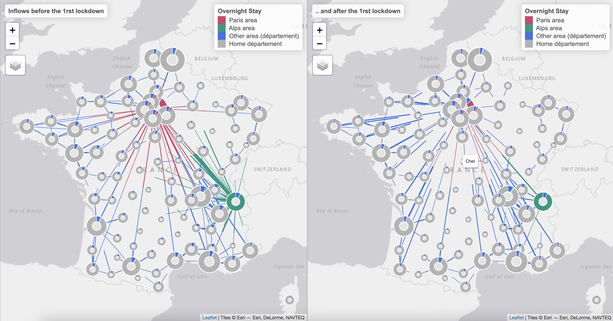

# Datavisualisation: Mouvements de population autour du confinement de mars 2020

## Le projet en quelques mots

Ce projet documente les mouvements de population autour du confinement de mars 2020 à partir d'indicateurs anonymes issus de la téléphonie mobile fournis à l'Insee par trois opérateurs de téléphonie mobile et que l'Insee a combiné aux estimations annuelles de population. Pour compléter ces résultats, une seconde exploitation a été réalisée en partenariat avec CBS \(Institut de Statistiques Néerlandais\) permettant une visualisation fine des changements de population observés avant, et pendant, le premier confinement. Celle-ci offre la possibilité d’observer, de façon interactive et département par département, les changements observés \(flux entrants et flux sortants\). Les données mobilisées dans cette visualisation sont accessibles [ici](https://www.insee.fr/fr/statistiques/fichier/5350073/mouvements_population_confinement_2020_csv.zip).

#### → Lien vers la [datavisualisation](https://inseefrlab.github.io/lockdown-maps-R/inflows_FR.html)

## Les usages du datalab 

Le projet a été réalisé avec Rstudio pour le traitement de données  et la visualisation. L'usage de Github a favorisé les échanges avec le CBS \(Institut de Statistiques Néerlandais\) mais aussi la réutilisation du code pour l'analyse de mouvement de population dans d'autres pays.

À compléter...

## En savoir plus sur le projet



## Autres liens utiles 

À compléter...

