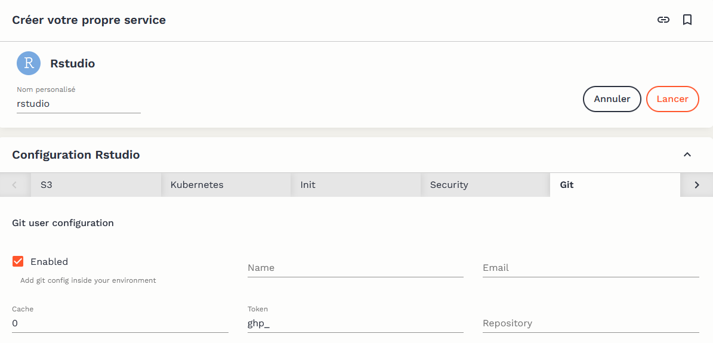

# Contrôle de version avec Git

## Pourquoi utiliser le contrôle de version ?

Le Datalab est une plateforme mutualisée : les ressources utilisées par les services sont partagées entre les différents utilisateurs. A ce titre, les services du Datalab fonctionnent sur le modèle des conteneurs éphémères : dans un usage standard, l'utilisateur lance un service, réalise des traitements de données, sauvegarde le code qui a permis de réaliser ces traitements, et supprime l'instance du service. Cette sauvegarde du code est grandement facilitée par l'usage du contrôle de version.

Cette considération de performance ne doit cependant pas être vue comme une contrainte : le contrôle de version est une bonne pratique essentielle de développement. Les bénéfices sont nombreux, aussi bien à titre individuel :&#x20;

* le projet local est synchronisé avec un serveur distant, rendant la perte de code quasi impossible ;&#x20;
* l'historique complet des choix et modifications effectuées sur le projet est conservé ;
* l'utilisateur peut parcourir cet historique pour rechercher les modifications qui ont pu créer des erreurs, et décider à tout moment de revenir à une version précédente du projet, ou bien de certains fichiers.

que dans le cadre de projets collaboratifs :&#x20;

* le travail simultané sur un même projet est possible, sans risque de perte ;&#x20;
* l'utilisateur peut partager ses modifications tout en bénéficiant de celles des autres ;
* il devient possible de contribuer à des projets open-source, pour lesquels l'usage de Git est très largement standard.


Ce tutoriel vise à présenter comment le contrôle de version peut être facilement implémenté grâce aux outils présents sur le Datalab. Il ne présente pas le fonctionnement de Git et présuppose donc une certaine familiarité avec l'outil. De nombreuses ressources en ligne peuvent servir d'introduction ; l'utilisateur de R pourra par exemple consulter [ce guide](https://linogaliana.gitlab.io/collaboratif/git.html) et l'utilisateur de Python ce [chapitre de cours](https://linogaliana-teaching.netlify.app/course/git/). Une formation complète à Git sera bientôt proposée dans l'[espace formation ](https://www.sspcloud.fr/documentation)du Datalab.


## Intégration de GitHub avec le Datalab

### Pourquoi GitHub ?

Bien qu'une utilisation hors-ligne de Git soit possible, tout l'intérêt du contrôle de version réside dans la synchronisation de la copie locale d'un projet (_clone_) avec un dépôt distant (_remote_). Différents services de forge logicielle permettent cette synchronisation des projets Git, dont les plus connus sont [GitHub ](https://github.com)et [GitLab](https://about.gitlab.com). Dans la mesure où le premier dispose aujourd'hui de beaucoup plus de visibilité — par exemple, les dépôts de l'Insee, [InseeFr ](https://github.com/InseeFrL)et [InseeFrLab](https://github.com/InseeFrLab), sont sur GitHub — le Datalab propose une intégration facilitée avec GitHub, que nous présentons à travers ce tutoriel.


La suite du tutoriel nécessite de disposer d'un [compte GitHub](https://github.com/join).



Si l'utilisation du Datalab avec la plateforme GitHub est facilitée, elle n'est en aucun cas obligatoire : il reste tout à fait possible d'utiliser la forge logicielle de son choix pour la synchronisation des projets. Une [forge basée sur GitLab ](https://git.lab.sspcloud.fr)est notamment mise à disposition des utilisateurs du Datalab.h


### Créer un jeton d'accès (_token_)

La synchronisation avec un dépôt distant nécessite une authentification auprès de GitHub. Celle-ci s'effectue à l'aide d'un jeton d'accès personnel, qui doit être généré à partir du compte GitHub de l'utilisateur. Le service de génération est accessible à [cette adresse](https://github.com/settings/tokens). La [documentation GitHub ](https://docs.github.com/en/authentication/keeping-your-account-and-data-secure/creating-a-personal-access-token)(en Anglais) propose des illustrations pour guider le processus.

Pour générer un jeton, il est nécessaire de choisir un nom de jeton, un délai d'expiration et des droits d'accès (_scope_). Il est recommandé de choisir un délai court (30 jours) et un accès restreint (_repo _seulement) afin de limiter les risques de sécurité en cas de diffusion malveillante du jeton.&#x20;

.PNG>)

Une fois le jeton généré, ce dernier apparaît à l'écran. Un jeton ne peut être visualisé qu'une seule fois ; en cas de perte, il faudra en générer un nouveau.&#x20;

### Ajouter le jeton d'accès au Datalab

Il est recommandé d'ajouter ses jetons d'accès à un gestionnaire de mots de passe. Le jeton peut également être ajouté à la configuration "Services externes" du compte utilisateur sur le Datalab, ce qui permet au jeton d'être directement accessible au sein des services proposés sur la plateforme.

.PNG>)


Attention à bien utiliser dans les "Informations du compte" l'adresse mail associée à votre compte GitHub, c'est elle qui permet de lier effectivement les _commits _que vous effectuerez à votre compte GitHub.


## Utiliser Git avec les services du Datalab

Git est préconfiguré pour fonctionner nativement avec les différents services pertinents du Datalab. A l'ouverture d'un service, il est possible de configurer certains éléments. Si l'on a ajouté un jeton d'accès GitHub à son compte sur le Datalab, ce dernier est pré-configuré. Il est par ailleurs possible d'indiquer l'URL **complète **d'un _Repository _Git (ex : [https://github.com/InseeFrLab/onyxia](https://github.com/InseeFrLab/onyxia)), qui sera alors cloné à l'initialisation dans l'espace de travail de l'instance.

### Via le terminal

Le jeton d'accès GitHub est disponible dans le terminal des différents services via la variable d'environnement `$GIT_PERSONAL_ACCESS_TOKEN`. Afin d'éviter de devoir s'authentifier à chaque opération impliquant le dépôt distant (_clone_, _push _& _pull_), il est recommandé de cloner celui-ci en incluant le jeton d'accès dans le lien HTTPS, à l'aide de la commande suivante :

`git clone https://${GIT_PERSONAL_ACCESS_TOKEN}@github.com/<owner>/<repo>.git`

où \<owner> et \<repo> sont à remplacer respectivement par le nom d'utilisateur et le nom du dépôt GitHub.

### Via des interfaces graphiques intégrées

Les principaux services de production de code disponibles sur le Datalab disposent d'une interface graphique pour faciliter l'utilisation de Git :&#x20;

* RStudio : RStudio propose une interface graphique pour Git native et assez complète. La [documentation utilitR ](https://www.book.utilitr.org/git.html)présente son fonctionnement en détail ;
* Jupyter : le plugin [jupyterlab-git ](https://github.com/jupyterlab/jupyterlab-git)permet un interfaçage (assez sommaire) de Jupyter avec Git ;
* VSCode : VSCode propose nativement une interface graphique très bien intégrée avec Git et GitHub. Une [documentation détaillée ](https://code.visualstudio.com/docs/editor/versioncontrol)(en Anglais) présente les possibilités de l'outil.&#x20;


Les interfaces graphiques facilitent la prise en main de Git, mais ne remplacent jamais complètement l'usage de l'outil via un terminal du fait d'une intégration nécessairement imparfaite. Il est donc utile de se familiariser avec l'usage de Git via le terminal le plus tôt possible.

